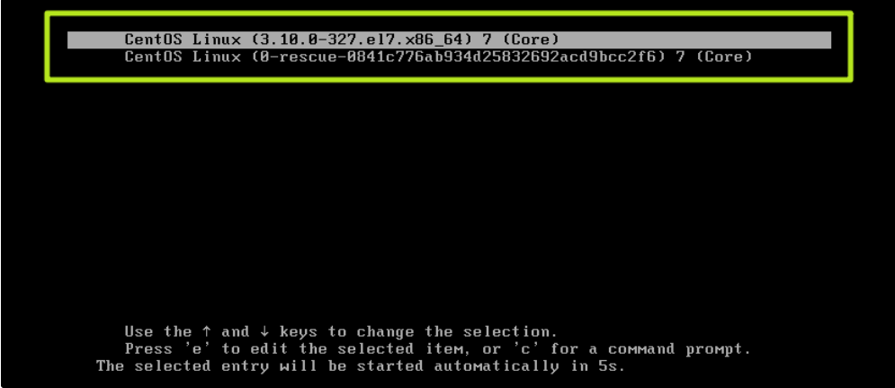
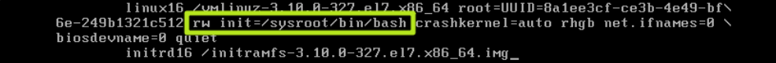
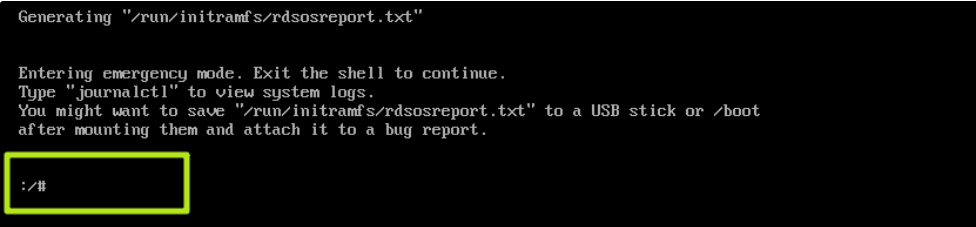
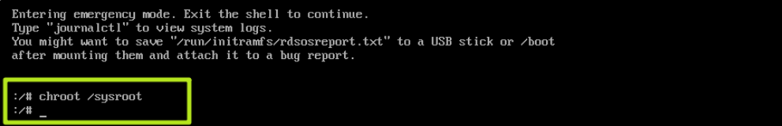
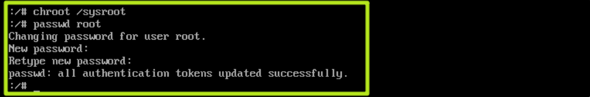
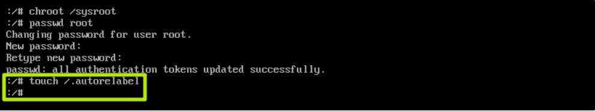
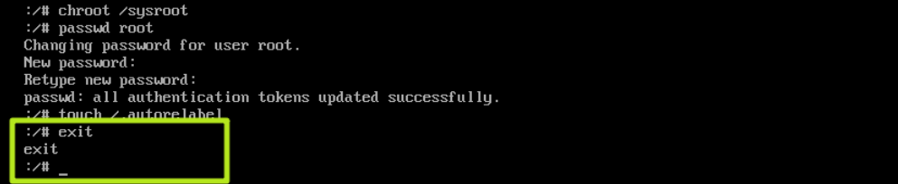
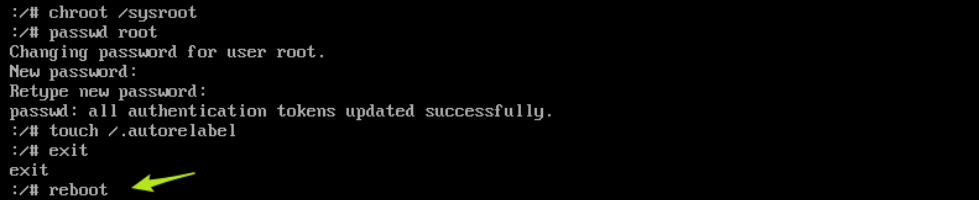

# Centos7 开机重置root密码

## 步骤：

### 1、 在启动GRUB菜单中选择编辑选项，按键 “e” 进入编辑;

### 2、修改“ro”为“rw init=/sysroot/bin/bash”

### 3、按ctrl + x 进入单用户模式

### 4、输入chroot /sysroot 命令进入系统

### 5、输入passwd root 命令重置root密码

### 6、输入 touch /.autorelabel 命令更新SELinux信息

##3 7、输入 exit 退出 chroot

### 8、输入reboot重启系统

### 9、登录系统测试
