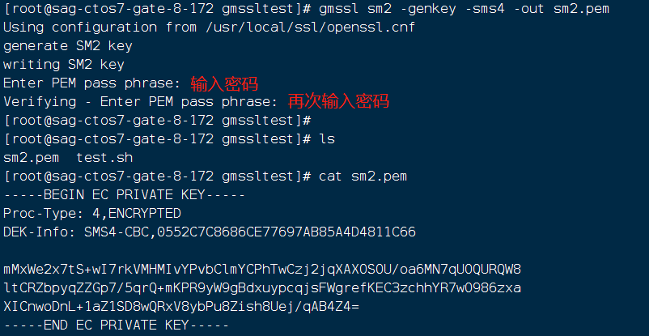
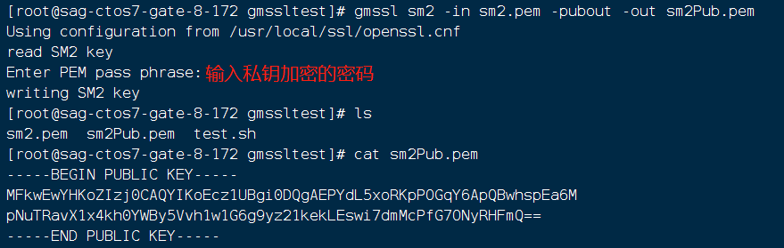
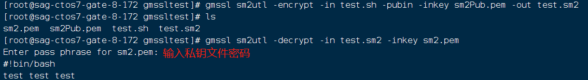
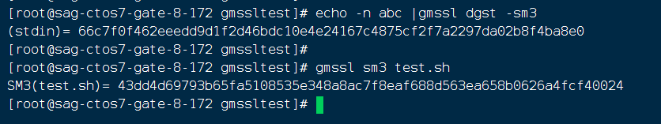
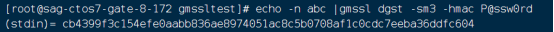
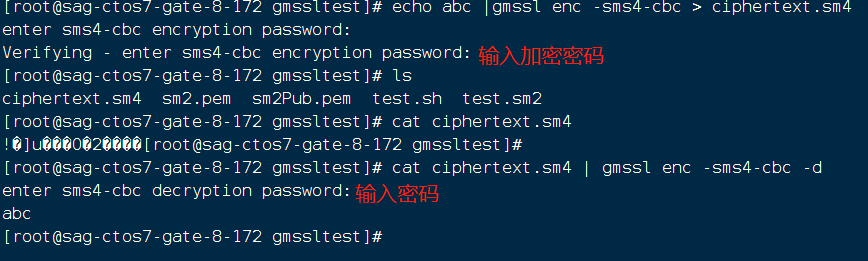
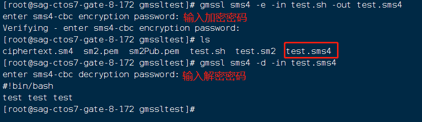

# 国密算法

## 1. SM2算法

### 1. 生成SM2私钥

    gmssl sm2 -genkey -sms4 -out sm2.pem

### 2. 将SM2私钥整数值转换为PEM格式的私钥

    gmssl sm2 -inform text -out sm2.pem

### 3. 导出SM2公钥

    gmssl sm2 -in sm2.pem -pubout -out sm2Pub.pem

### 4. 显示SM2私钥的Z值

    gmssl sm2 -genzid -in sm2.pem -id Alice -noout

### 5. 计算带Z值的杂凑值

    gmssl sm2utl -dgst -in msg.txt -pubin -inkey sm2Pub.pem -id Alice

### 6. 对消息签名

    gmssl sm2utl -sign -in msg.txt -inkey sm2.pem -id Alice -out sig.der
    gmssl sm2utl -verify -in msg.txt -sigfile sig.der -pubin -in sm2Pub.pem -id Alice
    
    注意：sm2utl是对消息签名，因此支持输入为任意长的消息。pkeyutl也可以进行SM2签名，但是输入是消息的杂凑值

### 7. 加密解密

    gmssl sm2utl -encrypt -in msg.txt -pubin -inkey sm2Pub.pem -out enced.der
    gmssl sm2utl -decrypt -in enced.der -inkey sm2.pem

### 注：如只需加解密，只需执行（1）、（3）、（7）步骤即可

### 示例如下：

#### 1. 生成SM2私钥：

    gmssl sm2 -genkey -sms4 -out sm2.pem

    私钥文件为sm2.pem,执行命令时需输入密码（自定义，加解密文件使用）私钥文件内容如下图所示。

#### 2. 导出SM2公钥：

    gmssl sm2 -in sm2.pem -pubout -out sm2Pub.pem

    导出公钥时，需输入私钥加密的密码，公钥文件为sm2Pub.pem，文件内容如下图所示：

#### 3. 对文件进行加密：

    gmssl sm2utl -encrypt -in test.sh -pubin -inkey sm2Pub.pem -out test.sm2

#### 4. 对文件进行解密：

    gmssl sm2utl -decrypt -in test.sm2 -inkey sm2.pem

    对test.sh文件加密后，生成文件test.sm2，对test.sm2文件解密时需输入私钥密码，解密成功后显示文件内容，如下图所示：

## 2.SM3算法

### 1. 对文件进行计算SM3杂凑值：

    gmssl sm3 text.sh

    输出如下所示：

### 2. 对输入信息进行计算SM3的杂凑值：

    echo -n abc | gmssl dgst -sm3

    输出入下所示：

### 3. 计算HMAC-SM3：

    echo -n abc | gmssl dgst -sm3 -hmac P@ssw0rd

    输出入下所示：

## 3.SM4算法

### 1. 对输入信息进行加密

    echo abc | gmssl enc -sms4-cbc > ciphertext.sm4

    加密输出的文件为ciphertext.sm4,此处选择的是CBC模式，加密时需输入密码

### 2. 对已加密的文件进行解密：

    cat ciphertext.sm4 | gmssl enc -sms4-cbc -d
    
    解密时需输入密码，如下图所示：

### 3. 对文件进行加密

    gmssl sms4 -e -in test.sh -out test.sms4

    对test.sh文件进行加密，加密输出文件为test.sms4，需输入密码

### 4. 对文件进行解密

    gmssl sms4 -d -in test.sms4

    对已加密的文件进行解密，需输入密码，如下所示：

