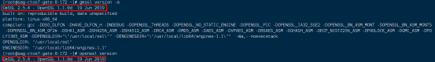

# 国密证书

## 1、安装步骤：

    国密证书安装包（linux）：gmssl.zip

    1：安装包依赖gcc，安装gcc
    yum install gcc -y

    2：解压安装包
    unzip gmssl.zip

    make install时会报错权限问题，先给权限（解压的包放到了/opt目录下）
    chmod 777 /opt/gmssl/util/point.sh

    3：通过以下指令进行编译安装：
    ./config
    make
    make install

    4：安装完查看版本：
    gmssl version -a

    或：openssl version
    输出GmSSL版本号即安装成功，如无误可看到如下信息：

    如果遇到如下的错误：
    openssl: error while loading shared libraries: libssl.so.1.1: cannot open shared object file: No such file or directory
    
    解决方法：
    find / -name libssl.so.1.1

    输出：/usr/local/lib64/libssl.so.1.1
    ln -s /usr/local/lib64/libssl.so.1.1 /usr/lib64/libssl.so.1.1
    ln -s /usr/local/lib64/libcrypto.so.1.1 /usr/lib64/libcrypto.so.1.1
    再次执行命令查看

## 2、制作加密证书，更改国密安装路径文件夹下的apps/openssl.cnf，添加：

    [ v3enc_req ]
    basicConstraints = CA:FALSE
    keyUsage = keyAgreement, keyEncipherment, dataEncipherment
    subjectAltName = @alt_names
    
    [ alt_names ]
    IP.1 = 127.0.0.1
    #DNS.1 = www.gmtest.com
    
    [ v3_ca ]
    subjectAltName = @alt_names

## 3、制作国密证书

    shell脚本gmcert.sh，可直接使用（需与createkey放在同一目录下），内容如下:

    #!bin/bash
    
    gmssl_path="/opt/gmssl"
    path=`pwd`
    name_ca="ca"
    server_sign="server_sign"
    server_encode="server_encode"
    
    chmod 777 $path/createkey
    
    echo "-----------------------------生成CA证书----------------------------------"
    ./createkey ${name_ca}
    gmssl req -new -SM3 -key ${name_ca}.key -out ${name_ca}.req -subj /C=CN/ST=JS/L=NJ/O=NJ/CN="127.0.0.1"
    gmssl x509 -req -days 3650 -sm3 -in ${name_ca}.req -extfile $gmssl_path/apps/openssl.cnf -extensions v3_ca -signkey ${name_ca}.key -out ${name_ca}.cer
    gmssl x509 -in ${name_ca}.cer -text -noout  
    rm -f ${name_ca}.req

    echo "-----------------------------Server签名证书----------------------------------"
    # Server签名证书
    ./createkey ${server_sign}
    gmssl req -new -SM3 -key $path/${server_sign}.key -out ${server_sign}.req -subj /C=CN/ST=JS/L=NJ/O=NJ/CN="127.0.0.1"
    gmssl x509 -req -SM3 -days 3650 -in $path/${server_sign}.req -extfile $gmssl_path/apps/openssl.cnf -extensions v3_req -CA $path/ca.cer -CAkey $path/ca.key -set_serial 1000000001 -extfile $gmssl_path/apps/openssl.cnf -out ${server_sign}.cer
    gmssl x509 -in $path/${server_sign}.cer -text -noout
    rm -f $path/${server_sign}.req
    
    echo "-----------------------------Server加密证书----------------------------------"
    # Server加密证书
    ./createkey ${server_encode}
    gmssl req -new -SM3 -key $path/${server_encode}.key -out ${server_encode}.req -subj /C=CN/ST=JS/L=NJ/O=NJ/CN="127.0.0.1"
    gmssl x509 -req -SM3 -days 3650 -in $path/${server_encode}.req -extfile $gmssl_path/apps/openssl.cnf -extensions v3enc_req -CA $path/ca.cer -CAkey $path/ca.key -set_serial 1000000001 -extfile $gmssl_path/apps/openssl.cnf -out ${server_encode}.cer
    gmssl x509 -in $path/${server_encode}.cer -text -noout
    rm -f $path/${server_encode}.req
    
    rm -f $path/createkey.key

## 4、国密内置命令生成key会导致go无法解析，使用二进制文件生成key

    命令：./createkey server_sign server_encode client_sign client_encode ca 
