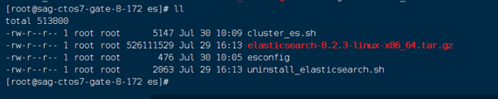
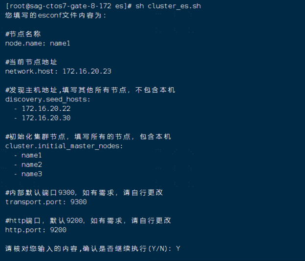
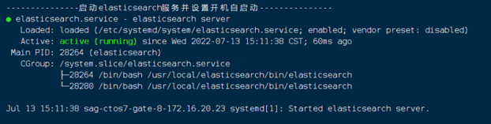
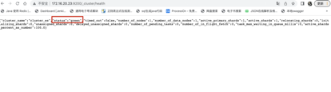
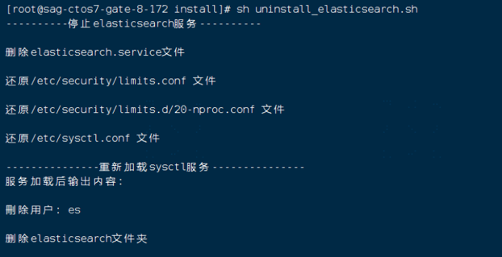
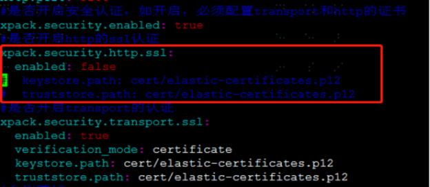
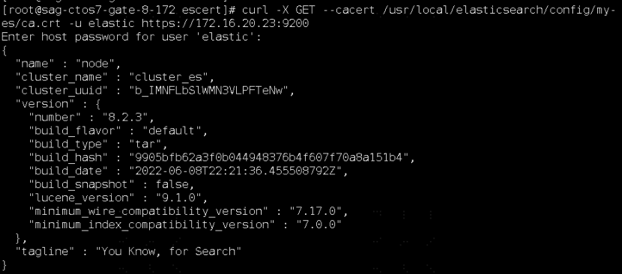

# ES集群安装部署文档

## 一、说明

    注意：多台机器进行进行部署时，所有机器必须进行时钟同步，例如三台网关服务器，需要将三台服务器进行时钟同步！！！（目前请手动执行时钟同步操作）
    以XShell为例：连接所有服务器，点击工具，发送键到所有会话输入如下命令即可（其他工具请自行查找类似功能）：
    命令：date -s 14:22:30 （设置服务器时为：14:22:30）
    需在每台机器上传安装包和安装脚本，安装脚本需在每台机器上执行！！！

### 1．准备工作

    ①　Elasticsearch安装依赖于JDK，首先检查系统是否安装了jdk:
    java -version
    ②　查找java相关得列表：yum -y list java*(如果没有yum命令的，网上百度，这个安装很简单)
    ③　到这一步之后，就继续安装jdk：yum -y install java-1.8.0-openjdk*。这个过程可能要持续几分钟的时间，跟自己的网速有一定的关系。
    ④　等到完成之后，检查jdk是否安装成功：java -version。(默认安装路径为：/usr/lib/jvm)
    ⑤　查看java安装路径：which java
    ⑥　JAVA配置 /etc/profile
    JAVA_HOME=/usr/lib/jvm/java-1.8.0-openjdk-1.8.0.292.b10-1.el7_9.x86_64
    export CLASSPATH=.:$JAVA_HOME/jre/lib/rt.jar:$JAVA_HOME/lib/dt.jar:$JAVA_HOME/lib/tools.jar
    export PATH=$PATH:$JAVA_HOME/bin
    ⑦　修改好/etc/profile配置文件使其立即生效
    命令：source /etc/profile

### 2．需要准备es离线安装包、安装脚本

### 3．模块说明

    Elasticsearch：主要用于日志的写入和转发
    监听的端口：
    9300：elasticsearch监听TCP的默认端口
    9200：elasticsearch监听http的默认端口

## 二、安装

    集群部署地址：
    集群节点	地址	        节点名称
    节点1	172.16.20.22	node1
    节点2	172.16.20.30	node2
    节点3	172.16.20.46	node3

### (1)安装

    安装步骤如下：
    注：Ctrl + c 也是中断脚本执行，如有输入错误，Ctrl + ← 为删除输入内容，安装目录为：/usr/local目录下
    ①　上传elasticsearch的安装包和安装脚本，确保在同一目录下即可
    ②　修改esconfig文件，如下图所示：
    node.name：当前节点名称
    network.host: 当前节点地址
    discovery.seed_hosts:发现主机地址,填写其他所有节点，不包含本机，多台机器请自行添加，格式必须保持一致对齐！！！
    cluster.initial_master_nodes:初始化集群节点，填写所有的节点，包含本机，多台机器请自行添加，格式必须保持一致对齐！！！
    transport.port: 内部默认端口9300，如有需求，请自行更改
    http.port: http端口，默认9200，如有需求，请自行更改

    ③　执行脚本命令：sh cluster_es.sh
    ④　请根据提示输入相关内容：
    如下图所示，核对确认后无误后，如继续执行，输入Y，中断执行，输入N

    ⑤　安装完成
    执行完脚本之后，出现如下内容代表安装成功：

### (2)验证

    ElasticSearch运行检查：

#### 1、节点检查

    浏览器URL地址栏输入：http://172.16.20.23:9200/

#### 2、节点查看

    浏览器URL地址栏输入：http://172.16.20.46:9200/_cat/nodes

#### 3、健康状况

    浏览器URL地址栏输入：http://172.16.20.23:9200/_cluster/health

#### 颜色状态：

    1)红色：表示数据不完整 ！！！

    2)黄色：数据完整，但是没有完整的副本

    原因：单机部署时，无副本分片，unassigned_shards的值不为0时导致的
    解决方法：执行如下命令（替换对应的IP地址即可）：
    curl -X PUT "172.16.20.23:9200/_settings" -H 'Content-Type: application/json' -d' {"number_of_replicas":0}'
    绿色：一切正常，有完整的主版本和副本

### (3)日常维护

    停止es服务
    systemctl stop elasticsearch
    
    启动es服务
    systemctl start elasticsearch

### (4)卸载

    卸载elasticsearch服务，请执行命令：sh uninstall_poc_elasticsearch.sh
    执行后输出内容如下：

### (5)SSL和TLS配置（可选）

    注：配置https 和 TLS 之前，必须先停止ES的服务！！！
    如要开启http的ssl认证，推荐使用生成SSL的标密证书方式（其余两种方式由于不是标密证书，网关无法连接ES正常写入或读取）

#### 1.生成SSL使用的标密证书

    ①　切换到ES的安装目录/usr/local/elasticsearch目录中：
    命令：cd /usr/local/elasticsearch/
    ②　生成ca证书
    ./bin/elasticsearch-certgen
    输出内容如下：
    Please enter the desired output file [certificate-bundle.zip]: cert.zip （生成的压缩包名称，输入或者保持默认，直接回车）
    Enter instance name: my-es (实例名)
    Enter name for directories and files [my-application]: elasticsearch（存储实例证书的文件夹名，可以随意指定或保持默认）
    Enter IP Addresses for instance (comma-separated if more than one) []: 172.16.20.23 (实例ip，多个ip用逗号隔开)
    Enter DNS names for instance (comma-separated if more than one) []: node（节点名，多个节点用逗号隔开）
    Would you like to specify another instance? Press 'y' to continue entering instance information: (到达这一步,不需要按y重新设置,按空格键就完成了) Certificates written to /usr/local/elasticsearch/bin/cert.zip（这个是生成的文件存放地址，不用填写）
    
    ③　解压certificate-bundle.zip或者自己输入的压缩包名称
    命令：unzip certificate-bundle.zip
    
    ④　在config文件家中创建cert文件夹
    命令：mkdir -p config/cert
    ⑤　把证书文件移动到config/cert中
    命令：cp ca/* my-es/* config/cert
    ⑥　更改cert文件夹所属用户（此步骤很重要！！！如不修改，可能会导致无法正常访问ES）
    chown -R es:es config/cert

#### 2.更改ES配置文件（ssl证书）

    修改所有ES节点的配置文件：
    xpack.security.enabled: true
    #是否开启http的ssl认证
    xpack.security.http.ssl:
    enabled: true
    key: cert/es-cert.key
    certificate: cert/es-cert.crt
    certificate_authorities: cert/ca.crt
    #是否开启transport的认证
    xpack.security.transport.ssl:
    enabled: true
    verification_mode: certificate
    key: cert/es-cert.key
    certificate: cert/es-cert.crt
    certificate_authorities: cert/ca.crt

#### 3.修改密码（可选）

    注：修改密码前，启动的es服务需关闭https认证，配置文件如下图所示：

    给认证的集群创建用户密码：
    设置密码,可以根据自己情况生成密码，
    使用的auto，生成随机密码
    cd /usr/local/elasticsearch/bin
    生成随机密码
    ./elasticsearch-setup-passwords auto
    或手动设置密码
    ./elasticsearch-setup-passwords interactive
    
    elastic 账号：拥有 superuser 角色，是内置的超级用户

#### 4.重启服务并验证

    重启集群各节点。
    ①　使用curl命令测试，输入账号elastic的密码：
    curl -X GET --cacert /usr/local/elasticsearch/config/my-es/ca.crt -u elastic https://172.16.20.23:9200
    如下图所示：

    ②　页面中输入：https://172.16.20.23:9200/_cluster/health，出现如下界面：

    ③　点击高级，继续访问，出现如下图所示的页面：

    ④　输入用户名密码后出现如下界面，则表示配置完成：

