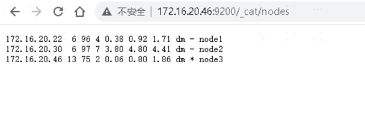
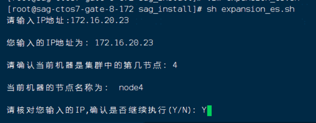
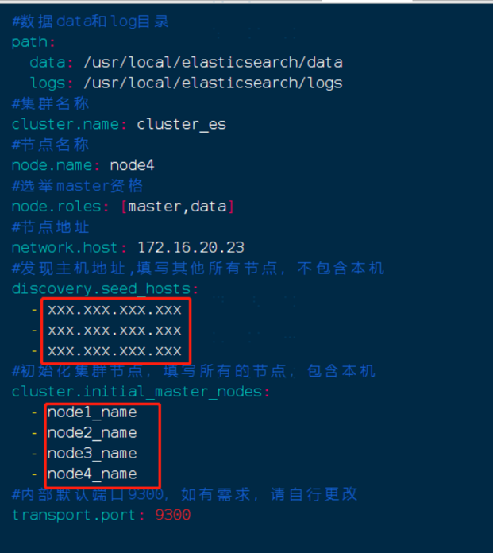
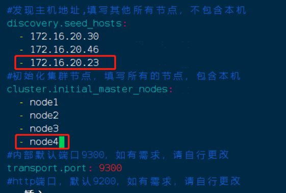
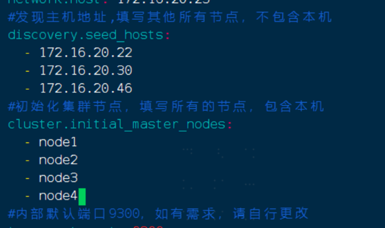
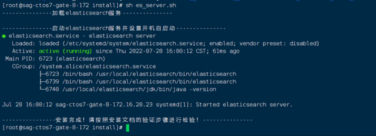

# ElasticSearch集群扩容

## 一、说明

    ElasticSearch集群：
    节点1：172.16.20.22  node1
    节点2：172.16.20.30  node2
    节点3: 172.16.20.46  node3

    要扩容的地址：
    扩容服务器地址：172.16.20.23 node4
    扩容前集群显示如下：

## 二、安装

    在要扩容的服务器执行安装脚本，执行命令：sh expansion_es.sh如下图所示：
    输入当前机器的ip地址
    输入当前机器为集群中的第几节点（集群数+1）

    安装完成后，ElasticSearch的配置文件如下图所示（下图只截取了部分配置），其中discovery.seed.hosts和cluster.initial_master.nodes的内容需要更改！

### 三、扩容

    更改集群中所有elasticsearch的配置文件：
    命令：vim /usr/local/elasticsearch/config/elasticsearch.yml
    
    更改集群中每个节点的配置文件，添加要扩容的的节点地址和名称，如下图所示：

    更改要扩容节点的配置文件，如下图所示：

### 四、重启验证

    集群的其他机器重启elasticsearch服务
    命令：systemctl restart elasticsearch
    
    扩容的机器执行命令：sh es_server.sh ，重新加载服务并设置启动，如下图所示：

    查看集群，浏览器中输入：https://172.16.20.46：9200/_cat/nodes
    可以看到如下图所示的界面，表示扩容成功：

