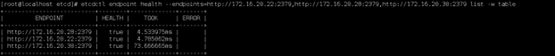

# ETD集群部署

## 一、说明

### 1.ETCD相关说明

    注：ETCD安装启动方式为http或https，请根据实际情况自行安装配置，集群部署，每台服务器都要执行安装脚本！！！

    端口号：
    2379：监听客户端通讯的端口
    2380：监听伙伴通讯的端口

### 2.安装包准备

#### (1)http安装包

#### (2)https安装包

## 二、HTTP安装

### 1.安装

    ①　上传安装包etcd.tar.gz，配置文件etcdconfig和安装脚本cluster_etcd.sh到同一目录下，如下图所示：

    ②　修改etcdconfig文件

    ③　执行脚本命令 sh cluster_etcd.sh
    
    ④　请根据提示输入相关内容：
    如下图所示，核对确认后无误后，如继续执行，输入Y，中断执行，输入N

    ⑤　安装完成
    脚本输出如下内容代表安装完成

### 2.验证

    ①　节点查看：
    命令：etcdctl member list -w table

    ②　查看节点健康状态
    命令：etcdctl endpoint health --endpoints=http://172.16.20.22:2379,http://172.16.20.28:2379,http://172.16.20.30:2379 list -w table

    ③　存入数据
    命令：etcdctl put hello world

    ④　读取数据：
    命令：etcdctl get hello

### 3.维护

    查看服务状态：
    systemctl status etcd

    停止服务：
    systemctl stop etcd

    重启服务：
    systemctl restart etcd

### 4.卸载

    请执行命令：sh uninstall_etcd.sh
    执行后输出内容如下：

## 三、HTTPS安装

### 1.安装

    ①　上传安装包etcd.tar.gz，配置文件etcdconfig和安装脚本cluster_etcd.sh到同一目录下，如下图所示：

    ②　修改证书配置文件etcd-ca.conf，根据实际情况添加IP地址，如下图所示：

    ③　生成Etcd的证书：ca.crt，etcd.key，etcd.crt
    执行命令：sh etcd-cert.sh
    命令执行完成之后，如下图所示：

    ④　把生成的证书传到集群的其他服务器的安装目录，上传完成之后，集群其他服务器的安装目录如下图所示：

    ⑤　修改etcdconfig文件

    ⑥　执行安装脚本
    命令 sh cluster_etcd_ssl.sh

    ⑦　请根据提示输入相关内容：
    如下图所示，核对确认后无误后，如继续执行，输入Y，中断执行，输入N

    ⑧　安装完成
    脚本输出如下内容代表安装完成

### 2.验证

#### 1.查看集群节点：

    etcdctl --cacert=/opt/etcd/ssl/ca.crt --cert=/opt/etcd/ssl/etcd.crt --key=/opt/etcd/ssl/etcd.key member list -w=table

#### 2.查看集群状态：

    etcdctl --cacert=/opt/etcd/ssl/ca.crt --cert=/opt/etcd/ssl/etcd.crt --key=/opt/etcd/ssl/etcd.key --endpoints=https://172.16.20.22:2379,https://172.16.20.28:2379,https://172.16.20.30:2379 endpoint status -w=table

#### 3.查看集群节点是否健康：

    etcdctl --cacert=/opt/etcd/ssl/ca.crt --cert=/opt/etcd/ssl/etcd.crt --key=/opt/etcd/ssl/etcd.key --endpoints=https://172.16.20.22:2379,https://172.16.20.28:2379,https://172.16.20.30:2379 endpoint health -w=table

#### 4.发送put请求：

    etcdctl --cacert=/opt/etcd/ssl/ca.crt --cert=/opt/etcd/ssl/etcd.crt --key=/opt/etcd/ssl/etcd.key put testetcd testvalue
    返回结果：OK

#### 5.发送get请求

    etcdctl --cacert=/opt/etcd/ssl/ca.crt --cert=/opt/etcd/ssl/etcd.crt --key=/opt/etcd/ssl/etcd.key get testetcd
    返回结果：testetcd
    testvalue

    至此安装部署已完成。

### 3.维护

    查看服务状态：
    systemctl status etcd

    停止服务：
    systemctl stop etcd

    重启服务：
    systemctl restart etcd

### 4.卸载

    请执行命令：sh uninstall_etcd.sh
    执行后输出内容如下：

 