# ETCD集群扩容

## 一、说明

    注：ETCD安装集群扩容分为为http或https，请根据实际情况自行选择安装扩容

    端口号：
    2379：监听客户端通讯的端口
    2380：监听伙伴通讯的端口

    ETCD集群：
    节点1：172.16.20.22  node1
    节点2：172.16.20.28  node2
    节点3: 172.16.20.30  node3

    要扩容的地址：
    扩容服务器地址：172.16.20.23 node4

## 二、http集群扩容

### 1.扩容

    ①　添加扩容节点，在任意集群的服务器上执行命令：
    etcdctl member add etcd04 --peer-urls=http://172.16.20.23:2380

    ②　查看集群列表：
    命令： expansion_https]# etcdctl  member list -w=table

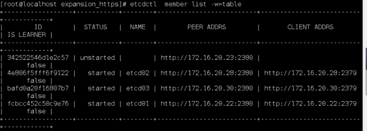

    ③　上传扩容安装包到要扩容的服务器上，如下图所示：

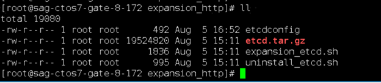

    ④　更改扩容配置文件etcdconfig

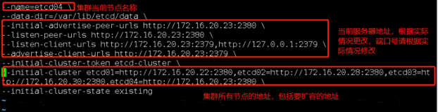

    ⑤　执行扩容安装脚本，sh expansion_etcd.sh

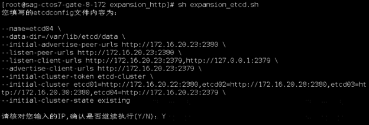

    ⑥　脚本输出如下内容代表安装完成

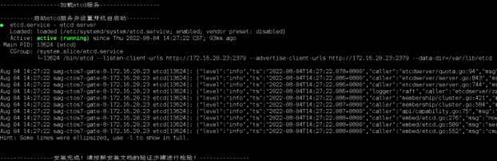

### 2.验证：

    ①　查看集群列表
    etcdctl member list -w=table

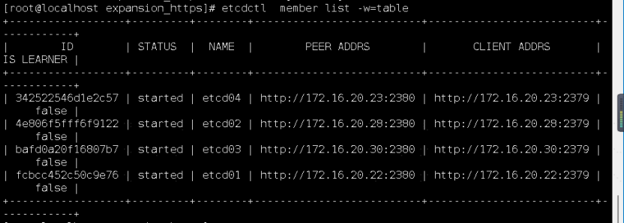

    ②　查看集群健康状态：
    etcdctl endpoint health --endpoints=http://172.16.20.22:2379,http://172.16.20.28:2379,http://172.16.20.30:2379,http://172.16.20.23:2379 -w=table

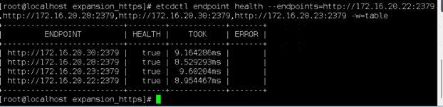

## 三、https集群扩容

### 1.证书生成

    ①　上传扩容安装包到要扩容的服务器上，如下图所示：

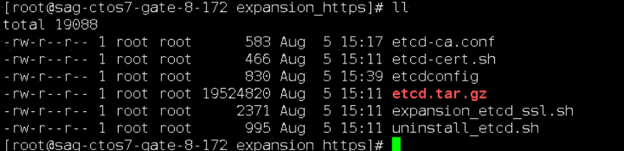

    ②　更改etcd的etcd-ca.conf证书配置文件，添加要扩容节点的DNS和IP地址

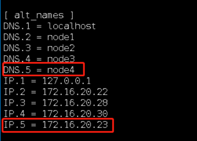

    ③　生成证书，执行命令：sh etcd-cert.sh
    如下图所示：

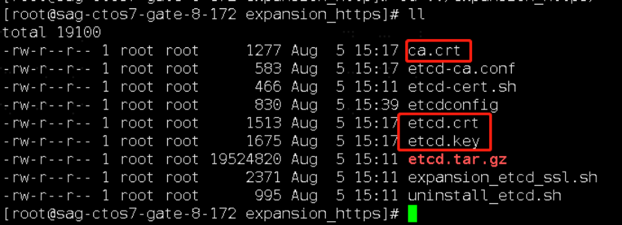

    ④　备份集群中的/opt/etcd/ssl文件夹，把ca.crt，etcd.crt，etcd.key三个文件分别上传到集群中的/opt/etcd/ssl目录下
    
    ⑤　重启集群各个节点的etcd服务
    systemctl restart etcd

### 2.扩容

    ①　添加扩容节点，在任意集群的服务器上执行命令：
    etcdctl --cacert=/opt/etcd/ssl/ca.crt --cert=/opt/etcd/ssl/etcd.crt --key=/opt/etcd/ssl/etcd.key member add etcd04 --peer-urls=https://172.16.20.23:2380

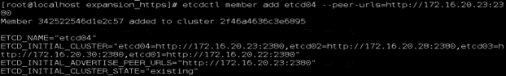

    ②　查看集群列表：
    命令： etcdctl --cacert=/opt/etcd/ssl/ca.crt --cert=/opt/etcd/ssl/etcd.crt --key=/opt/etcd/ssl/etcd.key member list -w=table

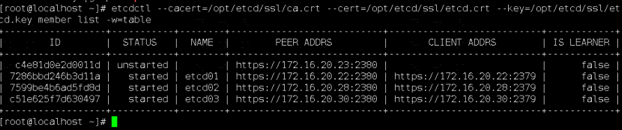

    ③　上传扩容安装包到要扩容的服务器上，如下图所示：

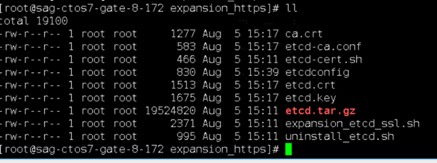

    ④　更改扩容配置文件etcdconfig

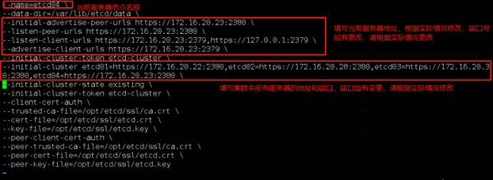

    ⑤　执行扩容安装脚本，sh expansion_etcd.sh

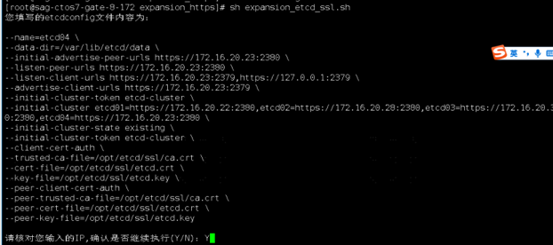

    ⑥　脚本输出如下内容代表安装完成

### 3.验证：

    ①　查看集群列表
    etcdctl --cacert=/opt/etcd/ssl/ca.crt --cert=/opt/etcd/ssl/etcd.crt --key=/opt/etcd/ssl/etcd.key member list -w=table

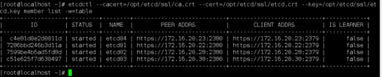

    ②　查看集群健康状态：
    etcdctl --cacert=/opt/etcd/ssl/ca.crt --cert=/opt/etcd/ssl/etcd.crt --key=/opt/etcd/ssl/etcd.key --endpoints=https://172.16.20.22:2379,https://172.16.20.28:2379,https://172.16.20.30:2379,https://172.16.20.23:2379 endpoint health -w=table

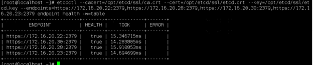

    至此，ETCD扩容完成！！！