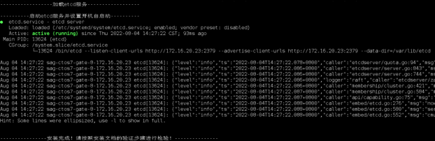

# ETCD单机部署

## 一、说明

### (1)Etcd相关说明

    注：ETCD安装启动方式为http或https，请根据实际情况自行安装配置
    端口号：
    2379：监听客户端通讯的端口
    2380：监听伙伴通讯的端口

### (2)http安装包准备

    Etcd的http安装包如下图所示：

### (3)https安装包准备

    Etcd的安装包如下图所示：

## 二、http安装

### (1)安装

    ①　上传安装包etcd.tar.gz和安装脚本install_etcd.sh到同一目录下，如下图所示

    ②　执行脚本命令：sh install_etcd.sh
    ③　根据提示输入相关内容，如下图所示，输入当前服务器的IP地址，核对确认后无误后，如继续执行，输入Y，中断执行，输入N

    ④　安装完成：脚本输出如下内容代表安装成功：

### (2)验证

    ①　节点查看：
    输入命令：etcdctl --endpoints http://172.16.20.23:2379 member list -w table

    ②　存入数据：
    输入命令：etcdctl --endpoints http://172.16.20.23:2379 put testtecd testvaule

    ③　读取数据：
    输入命令：etcdctl --endpoints http://172.16.20.23:2379 get testtecd

### (3)维护

    查看服务状态：
    systemctl status etcd

    停止服务：
    systemctl stop etcd

    重启服务：
    systemctl restart etcd

### (4)卸载

    请执行命令：sh uninstall_etcd.sh
    执行后输出内容如下：

## 三、https安装

### (1)安装

    ①　上传安装包etcd.tar.gz和安装脚本install_etcd.sh到同一目录下，如下图所示

    ②　修改etcd-ca.conf文件
    如下图所示，DNS.2和IP.2的值根据实际情况修改

    ③　执行脚本命令：sh install_etcd_ssl.sh
    ④　根据提示输入相关内容，如下图所示，输入当前服务器的IP地址，核对确认后无误后，如继续执行，输入Y，中断执行，输入N

    ⑤　安装完成：脚本输出如下内容代表安装成功：

### (2)验证

    ①　节点查看：
    输入命令：etcdctl --endpoints https://172.16.20.23:2379 --cacert=/opt/etcd/ssl/ca.crt --cert=/opt/etcd/ssl/etcd.crt --key=/opt/etcd/ssl/etcd.key member list -w=table

    ②　存入数据：
    输入命令：etcdctl --endpoints https://172.16.20.23:2379 --cacert=/opt/etcd/ssl/ca.crt --cert=/opt/etcd/ssl/etcd.crt --key=/opt/etcd/ssl/etcd.key put test testvaule

    ③　读取数据：
    输入命令：etcdctl --endpoints https://172.16.20.23:2379 --cacert=/opt/etcd/ssl/ca.crt --cert=/opt/etcd/ssl/etcd.crt --key=/opt/etcd/ssl/etcd.key get test

### (3)维护

    查看服务状态：
    systemctl status etcd

    停止服务：
    systemctl stop etcd

    重启服务：
    systemctl restart etcd

### (4)卸载

    请执行命令：sh uninstall_etcd.sh
    执行后输出内容如下：

