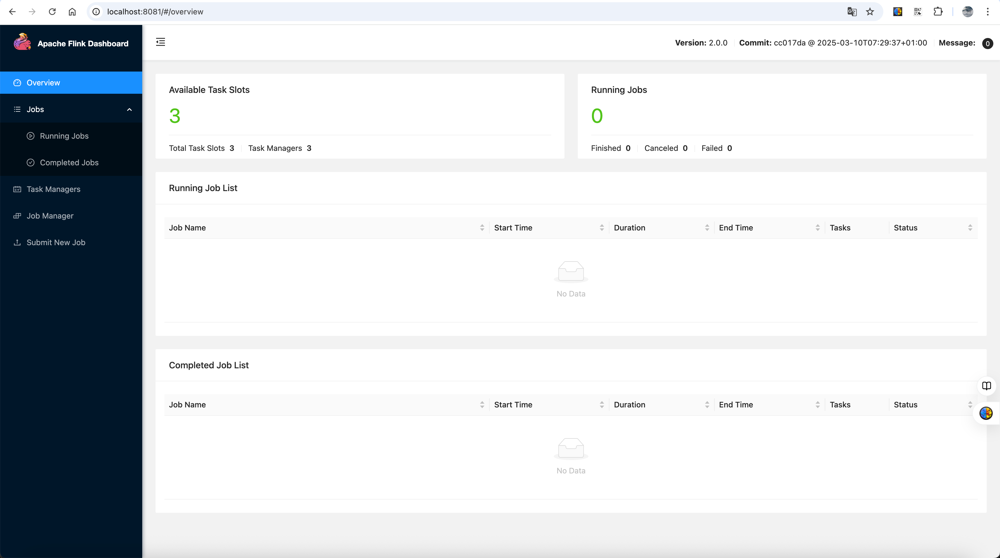
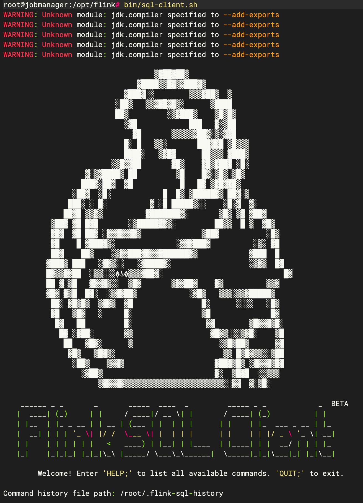
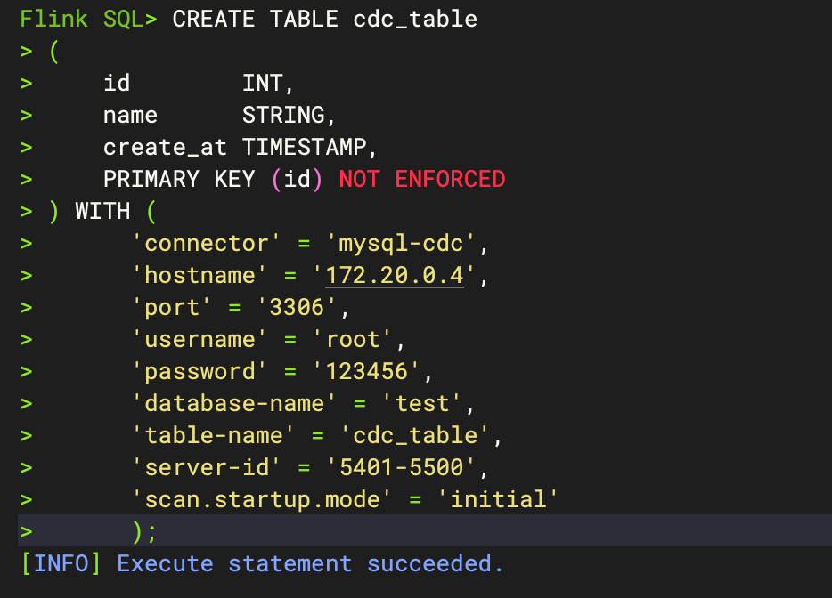
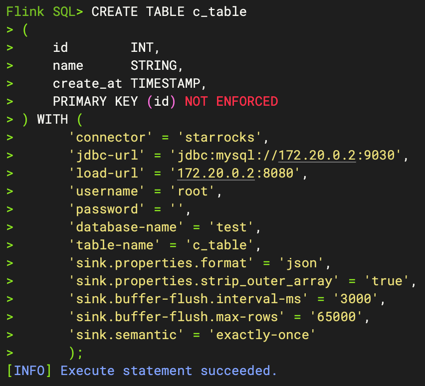
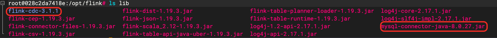
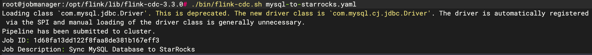

# Flink 集群安装

## 一、说明

flink集群部署时，docker 安装方式无需这些依赖，Working Directory安装方式需依赖jdk版本1.8以上，集群需要时钟同步，集群之间的服务器需要免密登陆！！！

### 1．准备工作

    ①　Flink安装依赖于JDK，版本需要在1.8以上，首先检查系统是否安装了jdk:
        java -version

    ②　查找java相关得列表：yum -y list java*(如果没有yum命令的，网上百度，这个安装很简单)

    ③　到这一步之后，就继续安装jdk：yum -y install java-1.8.0-openjdk*。这个过程可能要持续几分钟的时间，跟自己的网速有一定的关系。

    ④　等到完成之后，检查jdk是否安装成功：java -version。(默认安装路径为：/usr/lib/jvm)

    ⑤　查看java安装路径：which java

    ⑥　JAVA配置 /etc/profile
        JAVA_HOME=/usr/lib/jvm/java-1.8.0-openjdk-1.8.0.292.b10-1.el7_9.x86_64
        export CLASSPATH=.:$JAVA_HOME/jre/lib/rt.jar:$JAVA_HOME/lib/dt.jar:$JAVA_HOME/lib/tools.jar
        export PATH=$PATH:$JAVA_HOME/bin

    ⑦　修改好/etc/profile配置文件使其立即生效
        命令：source /etc/profile

### 2．需要准备flink离线安装包

### 3．时钟同步

    注意：集群部署时，所有机器必须进行时钟同步

#### 1. 手动同步

        以三台服务器，XShell连接工具为例：连接所有服务器，点击工具，发送键到所有会话输入如下命令即可（其他工具请自行查找类似功能）：
        命令：date -s 14:22:30 （设置服务器时为：14:22:30）

#### 2. chrony自动同步

         安装详情请查看：https://github.com/xiebingnote/personal-essay/blob/main/Linux/chrony/chrony.md

## 二、安装（standalone 独立部署模式）

### 1. docker-compose方式安装

    文件详情见docker-compose.yml文件

### 2. 执行按安装命令：

    docker-compose up -d

### 3. 检查8081端口，查看是启动成功，成功页面如下图所示：

## 三、实时同步数据

flink sql 和flank cdc 同步数据方式选择一种即可

### 1. 配置修改：

#### 1. flink配置修改

    1. 进入到flink的job和task容器内，编辑conf文件下的config.yml：
        vi conf/flink-conf.yaml
    2. 添加如下配置：timeout和interval单位ms
       execution.checkpointing.interval: 3000
       execution.checkpointing.timeout: 30000
    3. 同时修改taskmanager.numberOfTaskSlots的值，默认为1，只能启动一个job任务，根据实际情况修改

#### 2. mysql8.0版本配置修改

以IP地址172.22.0.4，mysql的root账号，密码123456为例，进入mysql容器内执行如下命令：

    1. 连接数据库
        mysql -h 127.0.0.1 -P 3306 -u root -p123456
    2. 执行如下命令
        SELECT user, host FROM mysql.user WHERE user = 'root';
        CREATE USER 'root'@'172.22.0.4' IDENTIFIED WITH mysql_native_password BY '123456';
        GRANT ALL PRIVILEGES ON *.* TO 'root'@'172.22.0.4' WITH GRANT OPTION;
        ALTER USER 'root'@'172.22.0.4' IDENTIFIED WITH mysql_native_password BY '123456';
        ALTER USER 'root'@'localhost' IDENTIFIED WITH mysql_native_password BY '123456';
        ALTER USER 'root'@'%' IDENTIFIED WITH mysql_native_password BY '123456';
        FLUSH PRIVILEGES;
        SELECT user, host FROM mysql.user WHERE user = 'root';

⚠️注：根据实际情况修改账户密码，修改后，无需重启mysql容器，如有无需的账户，请自行删除，删除示例：DROP USER 'root'@'172.20.0.2';

### 2. flink sql 同步方式

#### 1. 依赖jar包（文件在flink-sql目录下）

        flink-connector-starrocks-1.2.10_flink-1.18.jar
        flink-sql-connector-mysql-cdc-3.2.1.jar
        mysql-connector-java-8.0.27.jar
        注：jar包放到所有job和task容器内的/opt/flink/lib目录下，添加依赖后，需要重启job和task容器

#### 2. 数据同步

##### 1. 连接mysql和starrocks，创建源表和目标表结构

    mysql：以表cdc_table为源表为例：
        create table cdc_table
        (
            id        int auto_increment
            primary key,
            name      varchar(255) null,
            create_at datetime default CURRENT_TIMESTAMP null
        );

    starrocks：以表c_table为目标表为例
        create table c_table
        (
            id        int,
            name      varchar(255),
            create_at datetime
        );

##### 2. 进入jobmanager容器内，启动sql-client客户端

    bin/sql-client.sh

##### 3. 创建数据源表

    ⚠️注: connector和server-id值无需修改，
          scan.startup.mode的值有initial和latest-offset两种，选择initial是从创建表开始的数据开始同步，即全量同步，latest-offset是从最新的offset开始同步，即增量同步
          其余参数值根据实际情况修改

    CREATE TABLE cdc_table
    (
        id        INT,
        name      STRING,
        create_at TIMESTAMP,
        PRIMARY KEY (id) NOT ENFORCED
    ) WITH (
        'connector' = 'mysql-cdc',
        'hostname' = '172.20.0.4',
        'port' = '3306',
        'username' = 'root',
        'password' = '123456',
        'database-name' = 'test',
        'table-name' = 'cdc_table',
        'server-id' = '5401-5500',
        'scan.startup.mode' = 'initial'
    );

##### 4. 创建数据目标表

    ⚠️注: connector和sink参数值无需修改，如未更改starrocks端口，jdbc-url和load-url的端口无需更改
          其余参数值根据实际情况修改
          starrocks启动时，账号是root，password密码默认为空

    CREATE TABLE c_table
    (
        id        INT,
        name      STRING,
        create_at TIMESTAMP,
        PRIMARY KEY (id) NOT ENFORCED
    ) WITH (
        'connector' = 'starrocks',
        'jdbc-url' = 'jdbc:mysql://172.20.0.3:9030',
        'load-url' = '172.20.0.3:8080',
        'username' = 'root',
        'password' = '',
        'database-name' = 'test',
        'table-name' = 'c_table',
        'sink.properties.format' = 'json',
        'sink.properties.strip_outer_array' = 'true',
        'sink.buffer-flush.interval-ms' = '3000',
        'sink.buffer-flush.max-rows' = '65000',
        'sink.semantic' = 'exactly-once'
    );

##### 5. 创建同步任务

    INSERT INTO c_table SELECT id, name, create_at FROM cdc_table;

##### 6. 查看job任务

    在flink的页面查看job任务，Running Job 会有一个任务

##### 7. 同步数据测试

    在mysql的表中添加数据，3s（interval 配置为3秒）后，starrocks的表中数据也会同步过来

### 3. flink cdc 同步方式

#### 1. 依赖包（文件在flink-cdc目录下）

        flink-cdc-1.1.0（文件夹）
        mysql-connector-java-8.0.27.jar
        flink-cdc-pipeline-connector-starrocks-3.1.1.jar
        flink-cdc-pipeline-connector-mysql-3.1.1.jar
        注: flink-cdc-3.1.1文件夹放到job容器内的/opt/flink/lib目录下
            下载的flink-cdc-3.1.1-bin.tar.gz文件解压后，lib目录下无flink-cdc-pipeline-connector-starrocks-3.1.1.jar和flink-cdc-pipeline-connector-mysql-3.1.1.jar包,需自行加入
            mysql-connector-java-8.0.27.jar包放到所有job和task容器内的/opt/flink/lib目录下，添加依赖后，需要重启job和task容器

##### 1. 上传所需文件和jar包

##### 2. 配置yml文件

    文件名mysql-to-starrocks.yaml（可自行修改文件名），文件上传到jobmanager容器内的flink-cdc-3.1.1目录下，文件配置内容如下，根据实际情况进行修改：

    source:
      type: mysql
      hostname: 172.20.0.4
      port: 3306
      username: root
      password: 123456
      tables: test.cdc_table
      tables.exclude: information_schema\.*
      server-id: 5401-5500
      server-time-zone: UTC
      scan.startup.mode: initial
      #  scan.startup.mode: latest-offset
    
    sink:
      type: starrocks
      name: StarRocks Sink
      jdbc-url: jdbc:mysql://172.20.0.3:9030
      load-url: 172.20.0.3:8080
      username: root
      password: ""
      #  table.create.properties.replication_num: 1
      #  sink.buffer-flush.interval-ms: 1000
    
    #route:
      #  - source-table: test.cdc_table
      #    sink-table: test.cdc_table
    
    pipeline:
      name: Sync MySQL Database to StarRocks
      parallelism: 2

##### 3. 创建同步任务

    ./bin/flink-cdc.sh mysql-to-starrocks.yaml

##### 4. 查看job任务

    在flink的页面查看job任务，Running Job 会有一个任务

##### 5. 同步数据测试

    在mysql的表中添加数据，3s（interval 配置为3秒）后，starrocks的表中数据也会同步过来
    

