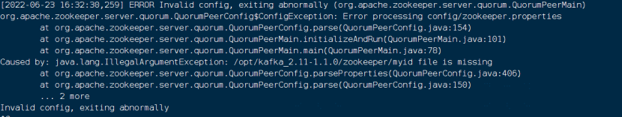
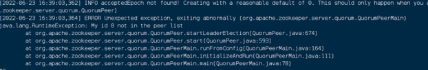

# Kafka安装部署手册

## 1.安装准备

    下载离线安装包：
    kafka_2.11-1.1.0.tgz

## 2.安装部署

### 2.1 解压安装文件

    tar xvf kafka_2.11-1.1.0.tgz -C /opt

### 2.2 JDK下载

    1、首先检查系统是否安装了jdk
    java -version

    2、查找java相关得列表：yum -y list java*(如果没有yum命令的，网上百度，这个安装很简单)

    3、到这一步之后，就继续安装jdk：yum -y install java-1.8.0-openjdk*。这个过程可能要持续几分钟的时间，跟自己的网速有一定的关系。

    4、等到完成之后，检查jdk是否安装成功：java -version。(默认安装路径为：/usr/lib/jvm)

    5、查看java安装路径：which java

    6、JAVA配置 /etc/profile
    JAVA_HOME=/usr/lib/jvm/java-1.8.0-openjdk-1.8.0.292.b10-1.el7_9.x86_64
    export CLASSPATH=.:$JAVA_HOME/jre/lib/rt.jar:$JAVA_HOME/lib/dt.jar:$JAVA_HOME/lib/tools.jar
    export PATH=$PATH:$JAVA_HOME/bin
    修改好/etc/profile配置文件使其立即生效
    命令：source /etc/profile

### 2.3 Zookeeper配置 以主机172.16.20.30为例

    # Licensed to the Apache Software Foundation (ASF) under one or more
    # contributor license agreements.See the NOTICE file distributed with
    # this work for additional information regarding copyright ownership.
    # The ASF licenses this file to You under the Apache License, Version 2.0
    # (the "License"); you may not use this file except in compliance with
    # the License.You may obtain a copy of the License at
    #
    #http://www.apache.org/licenses/LICENSE-2.0
    #
    # Unless required by applicable law or agreed to in writing, software
    # distributed under the License is distributed on an "AS IS" BASIS,
    # WITHOUT WARRANTIES OR CONDITIONS OF ANY KIND, either express or implied.
    # See the License for the specific language governing permissions and
    # limitations under the License.
    # the directory where the snapshot is stored.
    dataDir=/opt/kafka_2.11-1.1.0/zookeeper
    dataLogDir=/opt/kafka_2.11-1.1.0/logs/zookeeper
    # the port at which the clients will connect
    clientPort=2181
    # disable the per-ip limit on the number of connections since this is a non-production config
    #maxClientCnxns=0
    #设置连接参数，添加如下配置
    #为zk的基本时间单元，毫秒
    tickTime=2000
    #Leader-Follower初始通信时限 tickTime*10　
    initLimit=10
    #Leader-Follower同步通信时限 tickTime*5
    syncLimit=5　　
    
    #设置broker Id的服务地址
    server.0=172.16.20.30:2888:3888
    server.1=172.16.20.22:2888:3888
    server.2=172.16.20.46:2888:3888

### 2.4 kafka 配置 以主机172.16.20.30为例

    # Licensed to the Apache Software Foundation (ASF) under one or more
    # contributor license agreements.See the NOTICE file distributed with
    # this work for additional information regarding copyright ownership.
    # The ASF licenses this file to You under the Apache License, Version 2.0
    # (the "License"); you may not use this file except in compliance with
    # the License.You may obtain a copy of the License at
    #
    #http://www.apache.org/licenses/LICENSE-2.0
    #
    # Unless required by applicable law or agreed to in writing, software
    # distributed under the License is distributed on an "AS IS" BASIS,
    # WITHOUT WARRANTIES OR CONDITIONS OF ANY KIND, either express or implied.
    # See the License for the specific language governing permissions and
    # limitations under the License.
    
    # see kafka.server.KafkaConfig for additional details and defaults
    
    ############################# Server Basics #############################
    
    # The id of the broker. This must be set to a unique integer for each broker.
    broker.id=0
    
    ############################# Socket Server Settings##########################
    
    # The address the socket server listens on. It will get the value returned from
    # java.net.InetAddress.getCanonicalHostName() if not configured.
    #FORMAT:
    #listeners = listener_name://host_name:port
    #EXAMPLE:
    #listeners = PLAINTEXT://your.host.name:9092
    listeners=PLAINTEXT://172.16.20.30:9092
    
    # Hostname and port the broker will advertise to producers and consumers. If not set,
    # it uses the value for "listeners" if configured.Otherwise, it will use the value
    # returned from java.net.InetAddress.getCanonicalHostName().
    #advertised.listeners=PLAINTEXT://your.host.name:9092
    
    # Maps listener names to security protocols, the default is for them to be the same. See the config documentation for more details
    #listener.security.protocol.map=PLAINTEXT:PLAINTEXT,SSL:SSL,SASL_PLAINTEXT:SASL_PLAINTEXT,SASL_SSL:SASL_SSL
    
    # The number of threads that the server uses for receiving requests from the network and sending responses to the network
    num.network.threads=3
    
    # The number of threads that the server uses for processing requests, which may include disk I/O
    num.io.threads=8
    
    # The send buffer (SO_SNDBUF) used by the socket server
    socket.send.buffer.bytes=102400
    
    # The receive buffer (SO_RCVBUF) used by the socket server
    socket.receive.buffer.bytes=102400
    
    # The maximum size of a request that the socket server will accept (protection against OOM)
    socket.request.max.bytes=104857600
    
    
    ############################# Log Basics #############################
    
    # A comma separated list of directories under which to store log files
    log.dirs=/opt/kafka_2.11-1.1.0/logs/kafka
    
    # The default number of log partitions per topic. More partitions allow greater
    # parallelism for consumption, but this will also result in more files across
    # the brokers.
    num.partitions=1
    
    # The number of threads per data directory to be used for log recovery at startup and flushing at shutdown.
    # This value is recommended to be increased for installations with data dirs located in RAID array.
    num.recovery.threads.per.data.dir=1
    
    ############################# Internal Topic Settings#########################
    # The replication factor for the group metadata internal topics "__consumer_offsets" and "__transaction_state"
    # For anything other than development testing, a value greater than 1 is recommended for to ensure availability such as 3.
    offsets.topic.replication.factor=1
    transaction.state.log.replication.factor=1
    transaction.state.log.min.isr=1
    
    ############################# Log Flush Policy #############################
    
    # Messages are immediately written to the filesystem but by default we only fsync() to sync
    # the OS cache lazily. The following configurations control the flush of data to disk.
    # There are a few important trade-offs here:
    #1. Durability: Unflushed data may be lost if you are not using replication.
    #2. Latency: Very large flush intervals may lead to latency spikes when the flush does occur as there will be a lot of data to flush.
    #3. Throughput: The flush is generally the most expensive operation, and a small flush interval may lead to excessive seeks.
    # The settings below allow one to configure the flush policy to flush data after a period of time or
    # every N messages (or both). This can be done globally and overridden on a per-topic basis.
    
    # The number of messages to accept before forcing a flush of data to disk
    #log.flush.interval.messages=10000
    
    # The maximum amount of time a message can sit in a log before we force a flush
    #log.flush.interval.ms=1000
    
    ############################# Log Retention Policy #########################
    # The following configurations control the disposal of log segments. The policy can
    # be set to delete segments after a period of time, or after a given size has accumulated.
    # A segment will be deleted whenever *either* of these criteria are met. Deletion always happens
    # from the end of the log.
    
    # The minimum age of a log file to be eligible for deletion due to age
    log.retention.hours=168
    
    # A size-based retention policy for logs. Segments are pruned from the log unless the remaining
    # segments drop below log.retention.bytes. Functions independently of log.retention.hours.
    #log.retention.bytes=1073741824
    
    # The maximum size of a log segment file. When this size is reached a new log segment will be created.
    log.segment.bytes=1073741824
    
    # The interval at which log segments are checked to see if they can be deleted according
    # to the retention policies
    log.retention.check.interval.ms=300000
    ############################# Zookeeper #############################
    
    # Zookeeper connection string (see zookeeper docs for details).
    # This is a comma separated host:port pairs, each corresponding to a zk
    # server. e.g. "127.0.0.1:3000,127.0.0.1:3001,127.0.0.1:3002".
    # You can also append an optional chroot string to the urls to specify the
    # root directory for all kafka znodes.
    zookeeper.connect=172.16.20.30:2181,172.16.20.22:2181,172.16.20.46:2181
    
    # Timeout in ms for connecting to zookeeper
    zookeeper.connection.timeout.ms=6000

### 2.5 启动

#### 启动zookeeper

    [root@localhostkafka_2.11-1.0.0]# bin/zookeeper-server-start.sh config/zookeeper.properties &
    或后台运行
    [root@localhostkafka_2.11-1.0.0]# nohup bin/zookeeper-server-start.sh config/zookeeper.properties >logs/zookeeper/zookeeper.log 2>1 &

#### zookeeper开机自启动设置

    vim /etc/systemd/system/zookeeper.service
    
    [Unit]
    Description=Zookeeper server
    After=network.target  
    Before=kafka.service    #Before 表示在kafka启动前启动
    [Service]
    Type=simple
    User=root
    Group=root
    ExecStart=kafka目录地址/bin/zookeeper-server-start.sh kafka目录地址/config/zookeeper.properties
    Restart=always
    
    [Install]
    WantedBy=multi-user.target
    
    设置在开机时启用服务： systemctl enable zookeeper.service
    查看服务是否开机启动：systemctl is-enabled zookeeper.service
    结果输出 enabled，则设置成功

#### 启动kafka

    [root@localhostkafka_2.11-1.0.0]# ./bin/kafka-server-start.sh config/server.properties &
    或后台运行
    [root@localhostkafka_2.11-1.0.0]# nohup bin/kafka-server-start.sh config/server.properties >logs/kafka/kafka.log 2>1 &

#### kafka开机自启动设置

    vim /etc/systemd/system/kafka.service
    
    [Unit]
    Description=Apache Kafka server (broker)
    After=network.target  zookeeper.service    #After 表示在zookeeper启动后在启动
    
    [Service]
    Type=simple
    
    User=root
    Group=root
    ExecStart=kafka目录地址/bin/kafka-server-start.sh kafka目录地址/config/server.properties
    Restart=always
    
    [Install]
    WantedBy=multi-user.target
    
    设置在开机时启用服务： systemctl enable kafka.service
    查看服务是否开机启动：systemctl is-enabled kafka.service
    结果输出 enabled，则设置成功

### 2.6 问题解决

#### 报错：myid file is missing， 如下图所示：

    原因：缺少myid文件

    解决方法如下：
    在kafka文件夹的路径中：
    mkdir zookeeper
    cd zookeeper
    touch myid
    编辑myid文件，写入broker Id的编号，必须和server.X中的X相同

#### 报错： My id * not in the peer list

    原因： myid文件中的写入的编号和走zookeeper中的设置server.X的X不一致

    解决方法：更改为一致即可