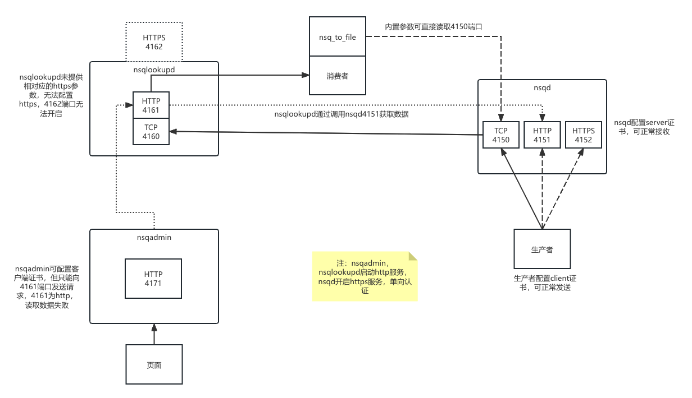

# NSQ Config for https

## NSQ 配置 https

    NSQ 无法完全支持https，生产者和nsqd可以配置https，但是nsqlookupd不支持https。
    所以，生产者和nsqd需要配置https，nsqlookupd需要配置http。

### Nsqd

    nsqd 开放三个端口：4150(tcp)，4151(http)，4152(https)，生产者配置client 证书，nsqd 配置server 证书。
    生产者通过https端口连接nsqd，nsqd会验证client 证书。nsqd 通过 4152 端口接收来自生产者的消息。

### Nsqlookupd

    nsqlookupd 开放两个端口：4160(tcp)，4161(http)，未开放4162(https)端口，无法配置https。
    nsqlookupd通过4161端口向nsqd的4151端口发送请求获取数据，或者通过4160端口向nsqd的4150端口发送请求获取数据。
    nsq_to_file 工具通过内置参数可直接通过4150端口读取数据。
    由于nsqlookupd未开放4162端口，不支持https，所以无法通过nsqd的415252端口获取数据。

### Nsqadmin

    nsqadmin 页面通过http端口访问nsqlookupd，不支持https。无法通过nsqlookupd的https端口获取数据。