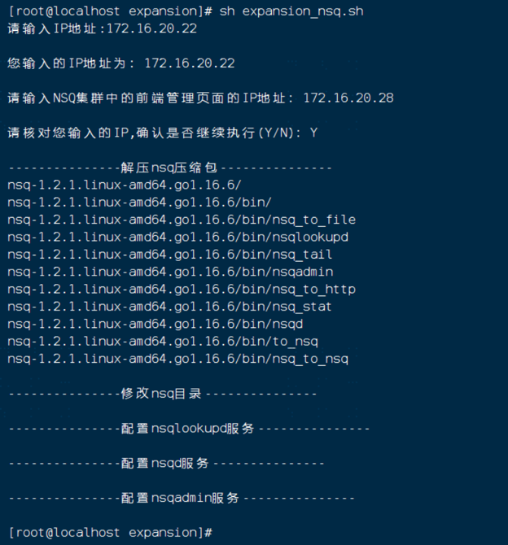

# NSQ扩容

## 一、说明：
### Nsq集群：
    节点1：172.16.20.28
    节点2：172.16.20.30
    要扩容的地址：
    扩容服务器地址：172.16.20.22

## 二、安装
    在要扩容的服务器执行安装脚本，执行命令：sh expansion_nsq.sh如下图所示：
    输入要安装的地址
    输入集群的前端页面管理地址

## 三、扩容
    停止集群的nsqlookupd，nsqd，nsqadmin服务
    在集群的每台机器上，更改nsqd.service文件，在ExecStart中添加 -lookupd-tcp-address=172.16.20.22:4160 ，如下图所示：
    命令：vim /etc/systemd/system/nsqd.service
    注：如果是多台，则添加多个：-lookupd-tcp-address=xxx.xxx.xxx.xxx:4160

    在要扩容的机器172.16.20.22上，同样打开nsqd.service文件，ExecStart的内容需要与集群中的每个节点的文件保持一致！！！如下图所示：

## 四、重启验证
    每台机器分别执行命令：sh nsq_server.sh ，重新加载服务并设置启动，如下图所示：

    根据安装文档的验证步骤检验，至此，nsq扩容完成