# NSQ 单机安装部署

## 一、说明

### 1．说明

    注：安装默认为http模式

#### nsqlookupd：作用类似nsqd的注册中心，也复制给消费者提供nsqd地址

    监听的端口：
    4160：TCP 用于接收nsqd的广播
    4161：HTTP 用于接收客户端发送的管理和发现操作请求(增删话题,节点等管理查看性操作等, 真正的生产与消费使用的是nsqd的4151端口)
    4162：HTTPS 用于接收客户端发送的管理和发现操作请求(增删话题,节点等管理查看性操作等, 真正的生产与消费使用的是nsqd的4152端口)

#### nsqd：管理topic和channel的守护进程，处理发布、订阅等指令的具体进程

    监听端口：
    4150：TCP
    4151：HTTP
    4152：HTTPS

#### nsqadmin：前端管理，提供WEB UI界面

    监听端口：
    4171：HTTP

### 2．需要准备nsq离线安装包、安装脚本如下图所示：

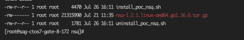

## 二、安装

### (1)安装

    安装步骤如下：
    注：Ctrl + c 为中断脚本执行，如有输入错误，Ctrl + ← 为删除输入内容

    ①　上传nsq安装包和安装脚本到root目录下，确保在同一文件夹内即可

    ②　执行脚本命令：sh install_poc_nsq.sh

    ③　请根据提示输入相关内容：
    如下图所示，单机部署请输入ip地址，核对确认后无误后，如继续执行，输入Y，中断执行，输入N

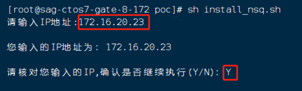

    ④　安装完成
    执行完脚本之后，出现如下内容代表安装成功：

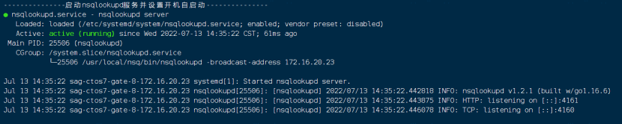

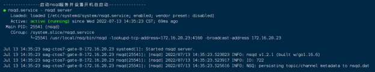

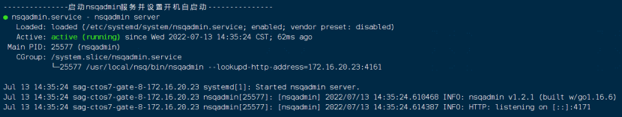

### (2)验证

    浏览器打开UI界面
    http://x.x.x.x:4171

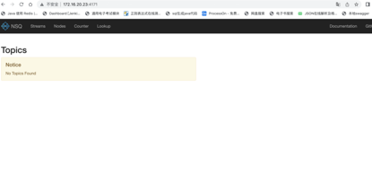

    在一个shell服务器上，创建topic，命令如下：
    curl -d 'hello world 1' 'http://172.16.20.23:4151/pub?topic=testtopic'
    如下图所示：

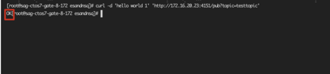

    刷新一下4171页面显示一个topic

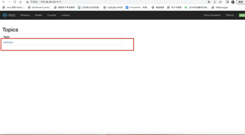

    注：nsq的安装路径为：/usr/local目录下

    在另一个shell中切换到nsq的安装目录的bin目录下：
    cd /usr/local/nsq/bin/

    开启nsq_to_file：
    ./nsq_to_file --topic=testtopic --output-dir=/root/nsqfile --lookupd-http-address=172.16.20.23:4161

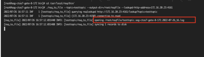

    接收topic的文件为路径为：/root/nsqfile/testtopic.sag-ctos7-gate-8-172.2022-07-26_16.log
    
    在另一个shell中查看/root/nsqfile/testtopic.sag-ctos7-gate-8-172.2022-07-26_16.log 文件，可以看到nsq成功接收了topic发送的内容：
    tail -f /root/nsqfile/testtopic.sag-ctos7-gate-8-172.2022-07-26_16.log

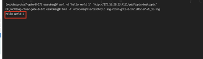

    也可在页面查看，输入地址：http://172.16.23.46:4171，如下图所示：
    注：172.16.23.46为启动nsqadmin的地址

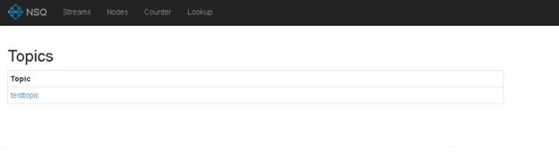

    点击testtopic，可以看到，messages和connections的数量，页面显示如下所示：

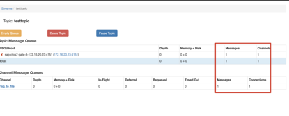

     删除测试的topic

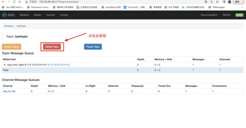

### (3)日常维护

    查看服务状态，请执行命令：
    systemctl status nsqlookupd
    systemctl status nsqd
    systemctl status nsqadmin

    停止服务，请执行命令：
    systemctl stop nsqlookupd
    systemctl stop nsqd
    systemctl stop nsqadmin

    启动服务，请执行命令：
    systemctl start nsqlookupd
    systemctl start nsqd
    systemctl start nsqadmin

### (4)卸载

    请执行命令：sh uninstall_poc_nsq.sh
    执行后输出内容如下：

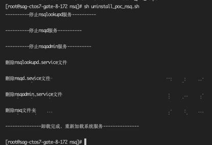

### (5)HTTPS配置（可选）

    注：配置https 之前，必须先停止NSQ的所有服务！！！

#### 1.证书制作

##### ①　生成新的公钥私钥对：

    openssl req -x509 -newkey rsa:2048 -keyout privatekey.pem -out cert.pem -days 3650 -nodes
    注释：
    openssl：命令
    req：申请证书
    -x509：输出一个X509格式的证书
    -newkey：生成一个2048长度的rsa私钥文件，用于签发
    rsa：rsa算法
    -keyout：输出私钥文件
    -out：输出公钥文件
    -days：签发证书有效日期

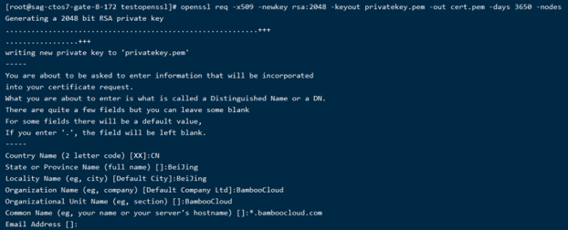

    Country Name (2 letter code) []:CN                                  // 输入国家代码，中国填写 CN
    State or Province Name (full name) []:BeiJing                       // 输入省份，这里填写 BeiJing
    Locality Name (eg, city) []:BeiJing                                 // 输入城市，这里填写 BeiJing
    Organization Name (eg, company) []:BambooCloud                      // 输入组织机构(或公司名）
    Organizational Unit Name (eg, section) []:BambooCloud               // 输入机构部门
    Common Name (eg, fully qualified host name) []:*.bamboocloud.com    // 输入域名  
    Email Address []:                                                   // 邮箱地址，可以不填写

##### ②　允许nsqd接受TLS升级请求：

    nsqd -tls-cert="cert.pem" -tls-key="privatekey.pem"

    注释：
    tls-cert：tls公钥文件（如不在证书目录下执行需填写具体路径）
    tls-key：tls私钥文件（如不在证书目录下执行需填写具体路径）
    tls-required：1为关闭HTTP端点，不设置为http和https都可使用

#### 2.更改服务配置

    更改nsqd服务文件，路径为： /etc/systemd/system/nsqd.service
    在ExecStart行最后添加参数：-https-address=172.16.20.46:4152 -tls-cert=/root/openssl/cert.pem -tls-key=/root/openssl/privatekey.pem -tls-required=false

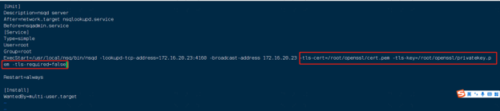

#### 3.重新加载服务并重启

    重新加载服务：
    systemctl daemon-reload

    重启所有服务：
    systemctl start nsqlookupd
    systemctl start nsqd
    systemctl start nsqadmin

